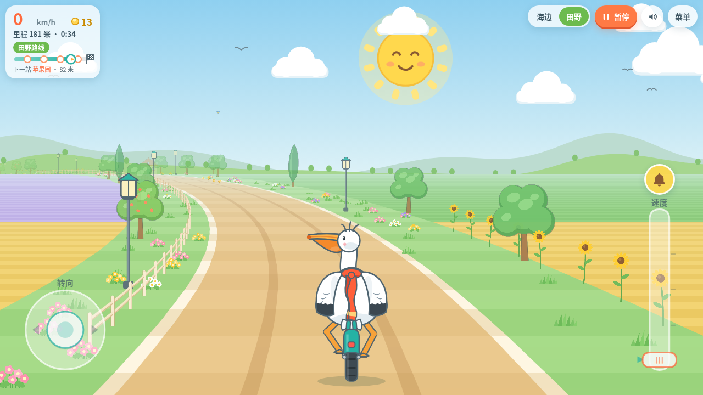
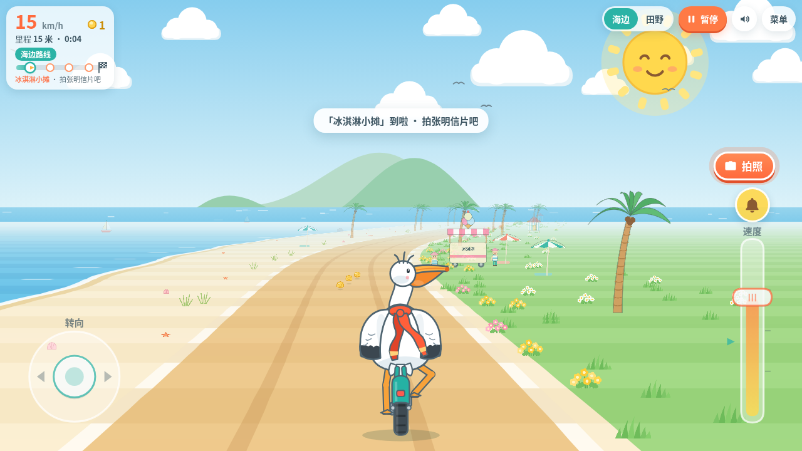
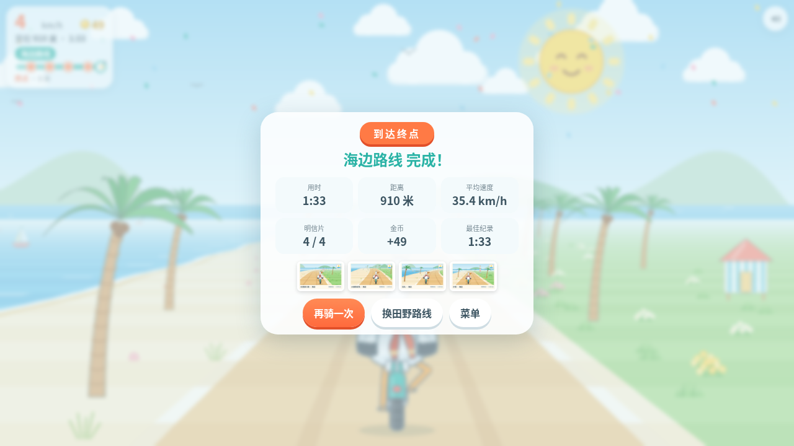
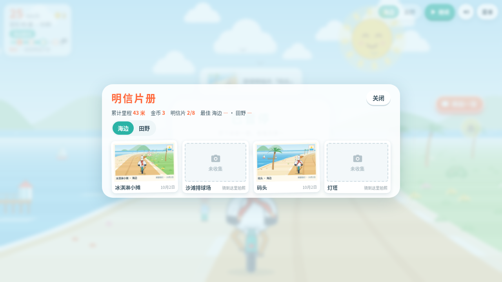

# 鹈鹕骑行 Pelican Ride

一个用网页 JavaScript（Canvas 2D）写的伪 3D 休闲骑行小游戏：控制一只骑自行车的鹈鹕，在海边和田野路线上骑行、看风景、拍明信片。

**在线试玩：** https://jiuju8866.github.io/pelican-ride/

## 玩法
- 左下角摇杆转向，右下角滑杆调速度（键盘：方向键 / WASD）
- 📷 靠近地标时拍照收集明信片（C 键），🔔 车铃（B 键）
- 暂停：P / Esc，静音：M
- 每条路线有起点、4 个地标和终点，到终点会显示成绩
- 时间与天气：清晨 / 正午 / 黄昏 / 夜晚 自动缓慢循环，天气随机出现晴、小雨、樱花（海边）或落叶（田野）；可在暂停菜单或标题页右上角「环境」里手动选择（自动 / 指定），选择会被记住
- 夜晚有星星、月亮、亮灯的窗户、路灯、灯塔光束和车头灯；下雨时路面湿润、有水洼倒影和雨声，夜里有蟋蟀声
- 风车转动、海浪翻涌、树木摇摆、云朵飘动、拱门旗子飘扬；鹈鹕停下时会左顾右盼、眨眼、鼓鼓喉囊，骑快了会张开翅膀，拍到明信片会开心地扭一扭

## 文件
- `index.html` + `game.js`：源码，无需构建
- `pelican-ride.html`：单文件版（由 `python3 build.py` 生成），离线双击即可玩
- `tools/`：Playwright 测试脚本

## 截图

