# 鹈鹕骑行 Pelican Ride

一个用网页 JavaScript（Canvas 2D）写的伪 3D 休闲骑行小游戏：控制一只骑自行车的鹈鹕，在七条风景路线上骑行、看风景、打卡收集明信片。全部画面与声音都是程序实时生成的，无外部资源，可离线游玩；也能「添加到主屏幕」像 App 一样离线打开（PWA）。

**在线试玩：** https://jiuju8866.github.io/pelican-ride/

## 路线（每条约 900 米，起点拱门 → 4 个地标 → 终点拱门）
| 路线 | 风景 | 地标（明信片） | 收集物 | 天气特色 |
|---|---|---|---|---|
| 海边路线 | 海浪、沙滩、椰树 | 冰淇淋小摊 · 沙滩排球场 · 码头 · 灯塔 | 金贝壳 | 小雨 / 樱花 |
| 田野路线 | 麦田、篱笆、风车 | 向日葵田 · 红谷仓 · 风车 · 苹果园 | 金币 | 小雨 / 落叶 |
| 森林小道 | 高大松树橡树、蘑菇、蕨类、小溪与木桥、小鹿松鼠 | 小木屋 · 瀑布 · 大橡树 · 蘑菇村 | 橡果 | 小雨 / 落叶 |
| 樱花大道 | 拱形樱花树、石灯笼、神社、河流 | 鸟居 · 拱桥 · 茶屋 · 樱花隧道 | 樱花 | 花瓣常年飘落，隧道里更多 |
| 海边小镇 | 彩色房子、遮阳篷小店、港口、彩旗、咖啡馆 | 钟楼 · 鱼市 · 咖啡馆 · 港口 | 小鱼 | 小雨 / 樱花 |
| 雪山之路 | 积雪路肩、雪松、雪山、木屋、雪人 | 雪人 · 缆车站 · 冰湖 · 山顶观景台 | 雪花 | 下雪（代替下雨） |
| 夜晚城市 | 亮灯的天际线、路灯、霓虹招牌、大桥、偶尔放烟花 | 电视塔 · 摩天轮 · 大桥 · 夜市 | 星星 | 默认夜晚，小雨 |

每条路线都有自己的环境音（森林鸟鸣与啄木鸟、樱花风铃、港口汽笛、雪山风声、城市车流与烟花）。

## 玩法
- 左下角摇杆转向，右下角滑杆调速度（键盘：方向键 / WASD）
- 📷 **地标打卡**（设置 →「打卡方式」，暂停菜单里也有一行快捷切换，选择会被记住）：
  - **自动打卡**（默认）：骑到地标附近，取景最好的那一刻（地标够大、还没滑出画面）自动拍照，闪光 + 快门声 +「打卡成功 · 地标名」+ 鹈鹕开心跳一下，明信片自动存进相册；每次骑过都会打卡。不用点任何按钮，打卡后会出现一个可选的小「再拍」按钮
  - **手动打卡**：和以前一样，地标附近出现跳动的「📷 拍照」按钮，点它或按 C
- 🔔 车铃（B 键），巡航（Q 键）
- 暂停：P / Esc，静音：M，选择路线：R
- **路线选择**：标题页是七张路线卡片（预览图、最佳成绩、明信片 x/4）；骑行中点右上角「路线」按钮或终点的「换路线」打开选择面板
- **明信片册**：七条路线各一个分页，共 28 张明信片
- 时间与天气：清晨 / 正午 / 黄昏 / 夜晚 自动缓慢循环，天气随机变化（每条路线有自己的变体）；可在暂停菜单或标题页右上角「环境」里手动选择，选择会被记住
- 夜晚有星星、月亮、亮灯的窗户（带柔光）、路灯、灯塔光束和车头灯；下雨时路面湿润有水洼，雪山上则积雪、飘雪
- 风车、瀑布、摩天轮、缆车、钟楼指针都会动；鹈鹕停下时会左顾右盼、眨眼、鼓鼓喉囊；夜晚城市的烟花更大更亮

## 设置（标题页「设置」或暂停菜单「设置」，全部自动保存）
- **打卡方式**：自动打卡 / 手动打卡
- **转向辅助**：关 / 轻 / 强 —— 弯道自动压弯，松手时慢慢回到路中间
- **巡航模式**：只管调速度，鹈鹕自己转向（会去吃前方的收集物、绕开障碍）；骑行中右上角「巡航」按钮或 Q 键快速切换
- **震动反馈**：冲出路面、碰撞、按铃、打卡、到达终点时震动（仅支持 `navigator.vibrate` 的设备）
- **音乐 / 环境音 / 音效** 三个独立音量，另有总静音（M）
- **画质**：自动 / 高 / 中 / 低。自动模式会测帧率：卡顿时降低像素比、绘制距离、小装饰数量、夜灯图层分辨率和粒子数量并关闭柔光，流畅时再升回去；夜晚城市默认从「中」开始。设置里显示当前档位和帧率
- **存档**：导出（JSON 文本，可复制）/ 导入 / 重置存档（需要二次确认）。存档是一个带版本号的 `localStorage` 键 `pelicanRide.v2`，旧版本的存档会自动迁移

## 换装（标题页「换装」）
用骑行收集的金币解锁，部分物品还需要收集一定数量的明信片：车身颜色（6 种）、围巾颜色（5 种）、帽子（草帽、毛线帽、棒球帽、花环、小皇冠）、眼镜（圆框墨镜、星星眼镜）、车筐里的小东西（花束、法棍、西瓜、小猫）。左侧是背影预览，点选即可试穿；穿上的装扮会出现在骑行画面和打卡明信片里。

## 文件
- `index.html` + `game.js`：源码，无需构建
- `manifest.json`、`sw.js`、`icon-192.png`、`icon-512.png`：PWA（图标由游戏里的鹈鹕绘制代码生成：`node tools/make-icons.js`）。Service Worker 缓存 index.html / game.js / manifest / 图标，相对路径，可在 GitHub Pages 的 `/pelican-ride/` 子路径下离线运行
- `pelican-ride.html`：单文件版（由 `python3 build.py` 生成），离线双击即可玩（不注册 Service Worker，也不带 manifest 链接）
- `tools/`：Playwright 测试脚本（`v6test.js` 覆盖自动/手动打卡、设置、辅助与巡航、换装、存档迁移与导入导出、PWA 离线）

## 截图
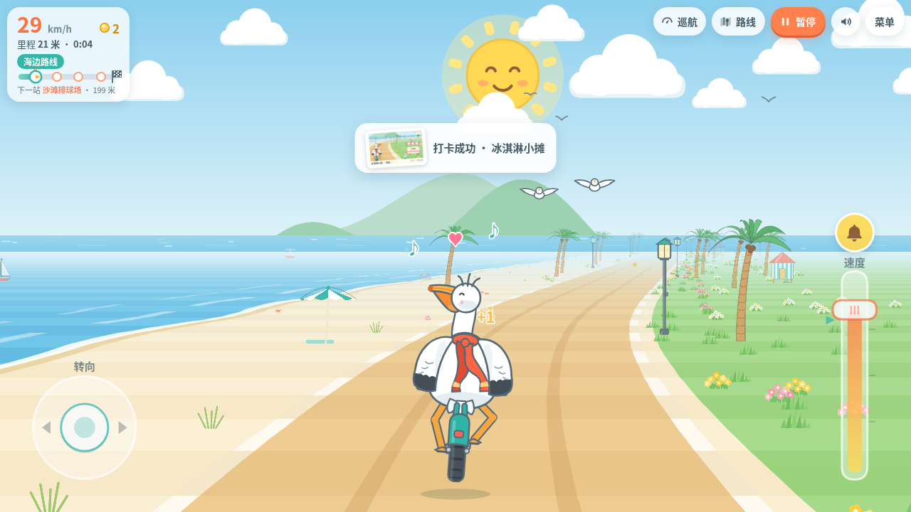
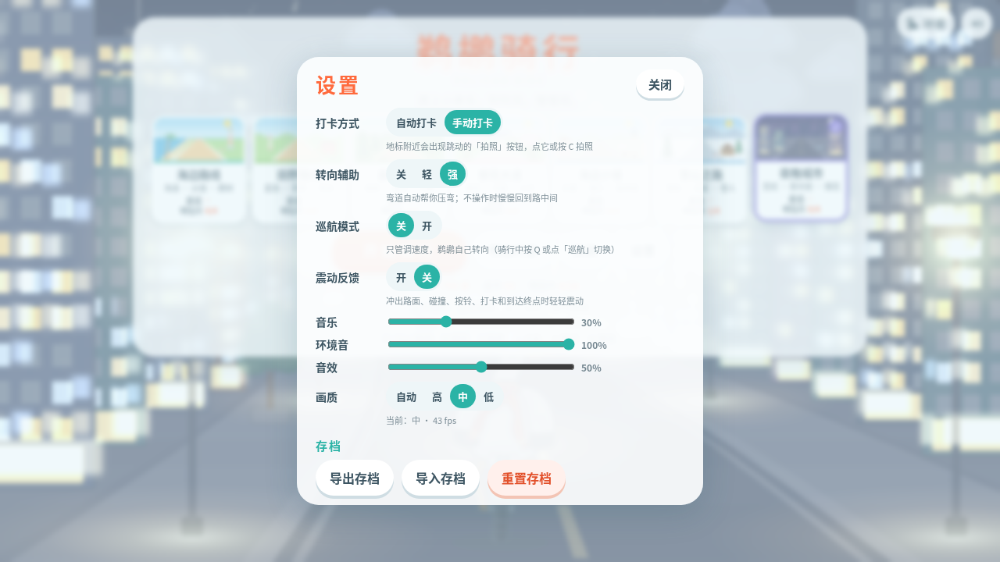
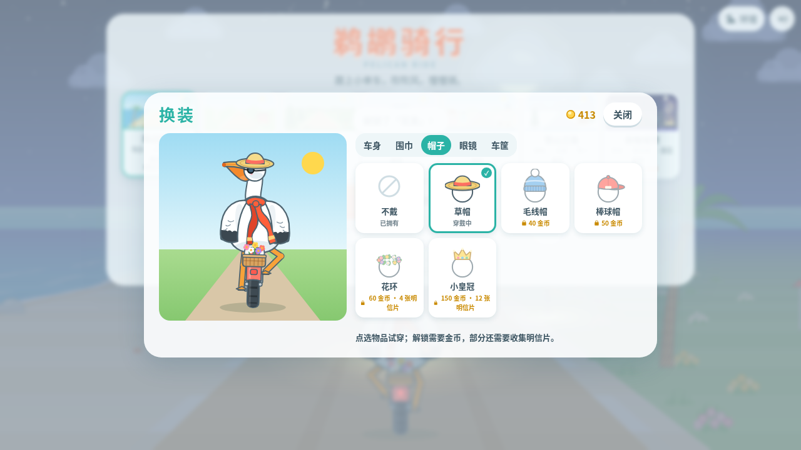
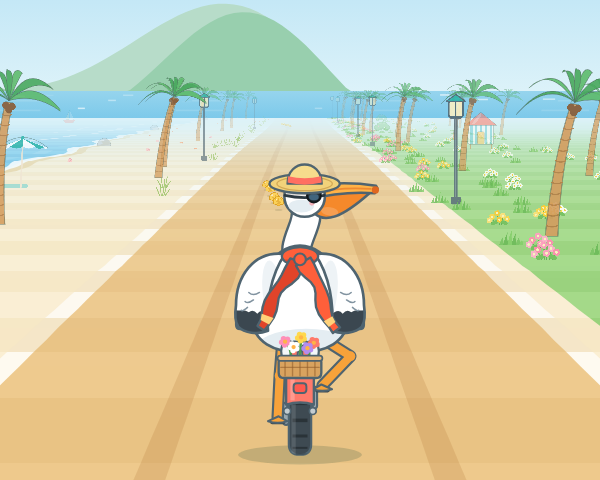
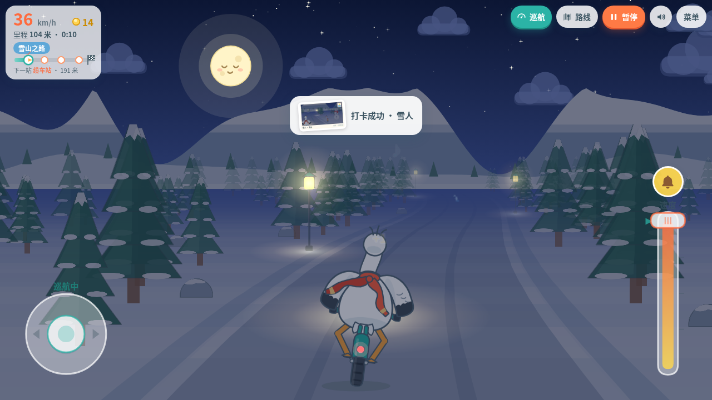
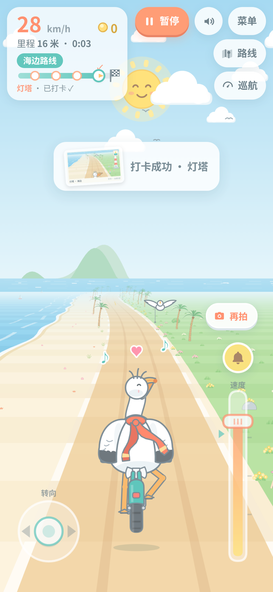

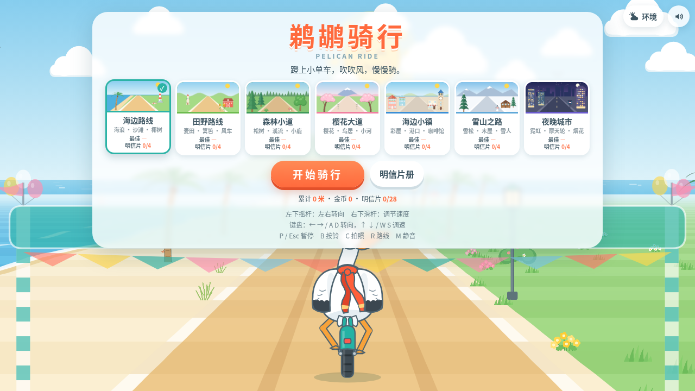
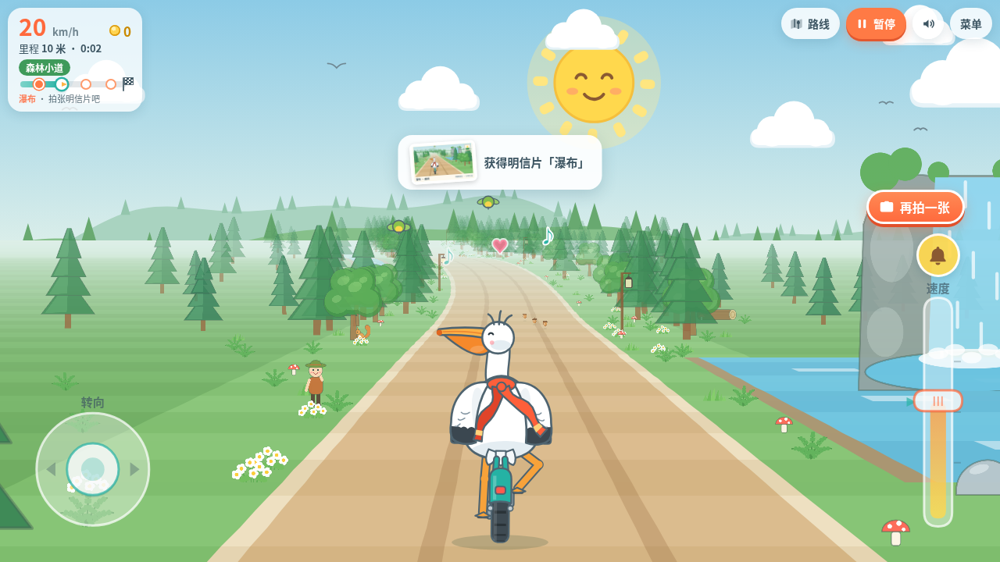
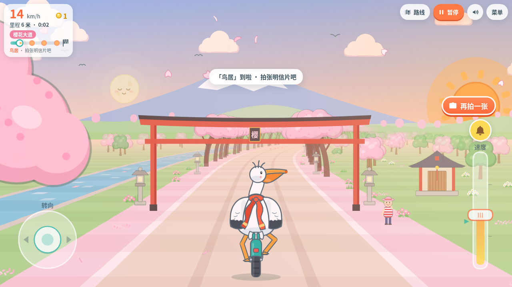
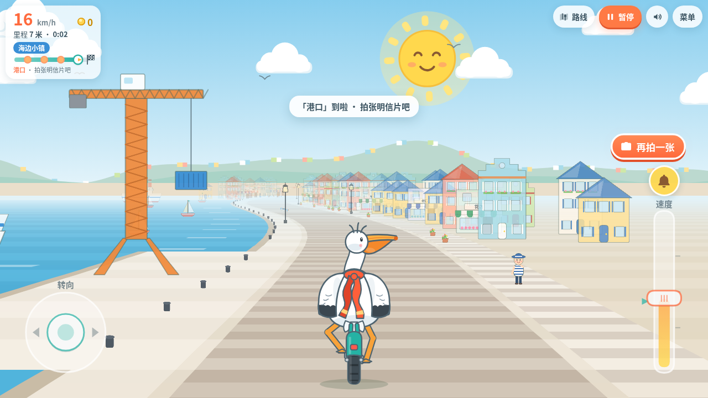
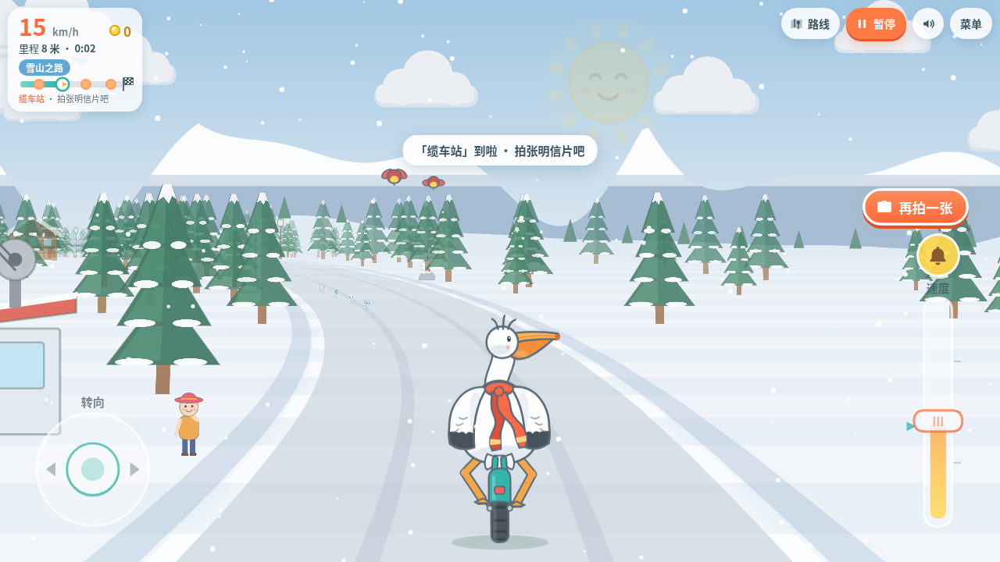
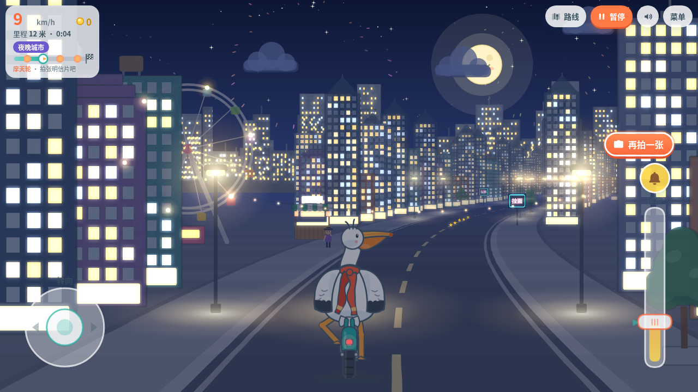
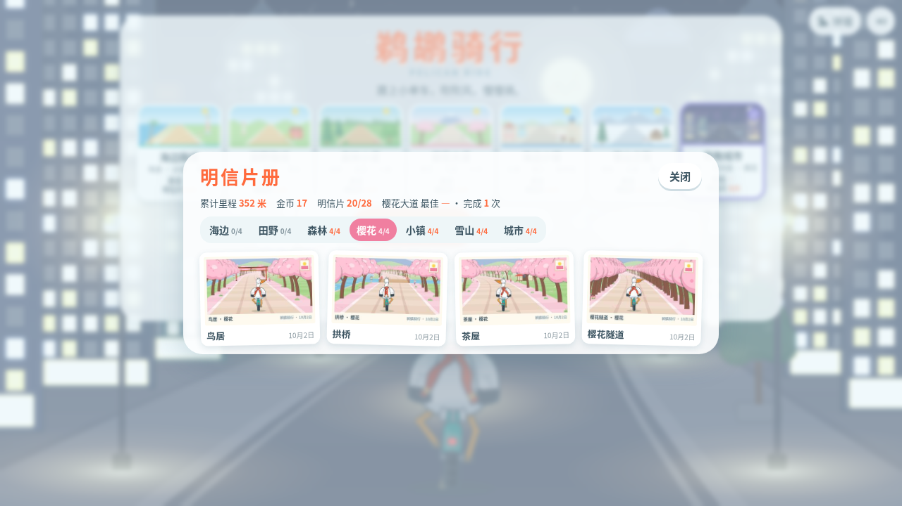
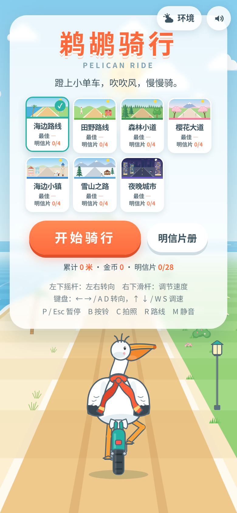

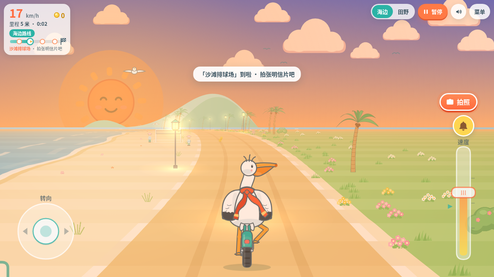
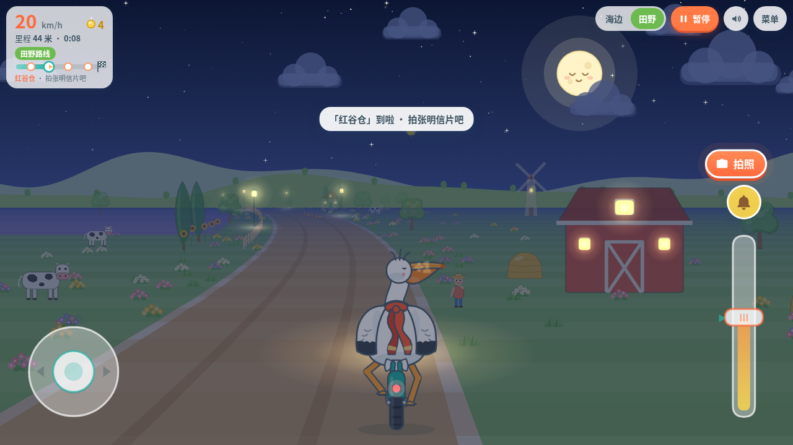
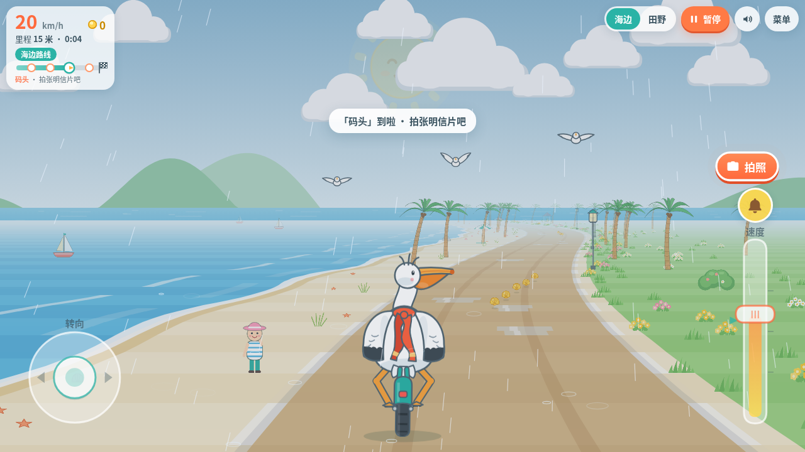
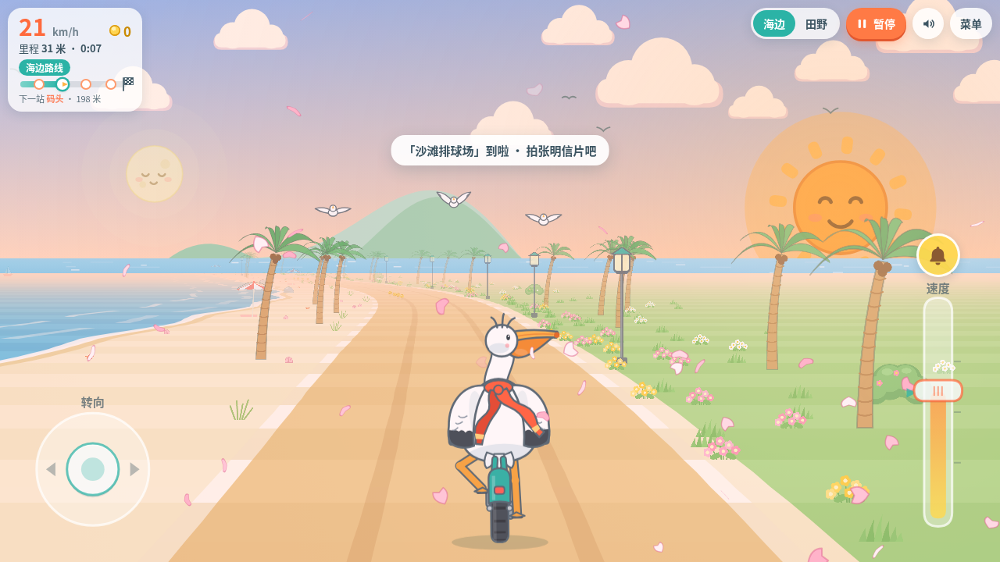
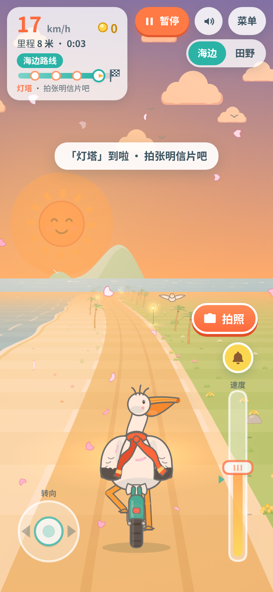
